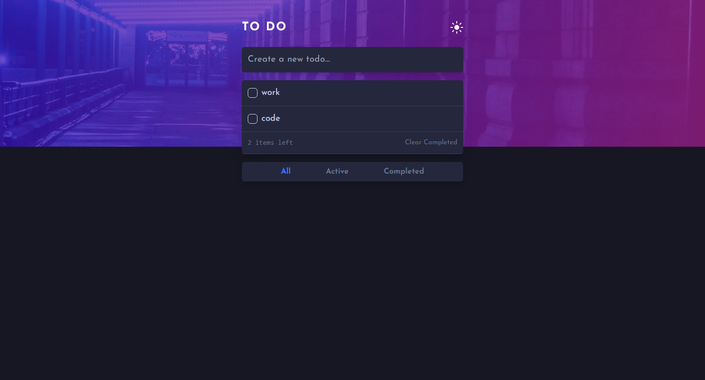
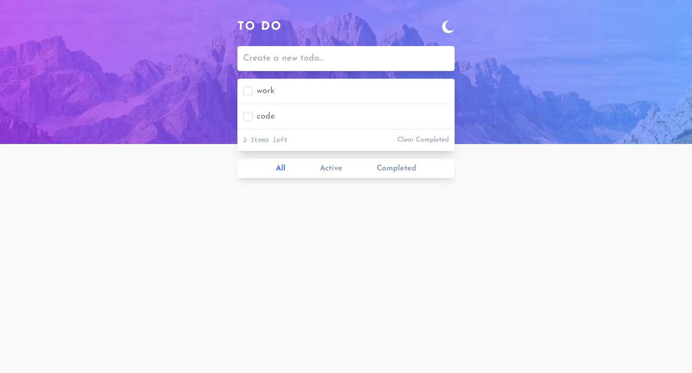

# Frontend Mentor - Todo app solution

This is a solution to the [Todo app challenge on Frontend Mentor](https://www.frontendmentor.io/challenges/todo-app-Su1_KokOW). Frontend Mentor challenges help you improve your coding skills by building realistic projects.

## Table of contents

- [Overview](#overview)
  - [The challenge](#the-challenge)
  - [Screenshot](#screenshot)
  - [Links](#links)
- [My process](#my-process)
  - [Built with](#built-with)
  - [What I learned](#what-i-learned)
- [Author](#author)

## Overview

### The challenge

Users should be able to:

- View the optimal layout for the app depending on their device's screen size. ✔
- See hover states for all interactive elements on the page. ✔
- Add new todos to the list. ✔
- Mark todos as complete. ✔
- Delete todos from the list. ✔
- Filter by all/active/complete todos. ✔
- Clear all completed todos. ✔
- Toggle light and dark mode. ✔
- **Bonus**: Drag and drop to reorder items on the list. x

### Screenshot

### Links

- Solution URL: [https://www.frontendmentor.io/solutions/responsive-and-animated-todo-app-with-react-VSM210kxvl](https://www.frontendmentor.io/solutions/responsive-and-animated-todo-app-with-react-VSM210kxvl)
- Live Site URL: [https://react-do-app.netlify.app/](https://react-do-app.netlify.app/)

## My process

### Built with

- [React](https://react.dev/) - JS library
- [Tailwind CSS](https://tailwindcss.com/) - A Utility-First CSS Framework
- [Framer Motion](https://www.framer.com/motion/) - A Powerful Animation Library for React

### What I learned

- How to manage CRUD operations in React for the first time.
- Tailwind CSS.
- Using Framer motion library for the first time.

## Author

- Frontend Mentor - [@Mahmoud-ElAgamy](https://www.frontendmentor.io/profile/Mahmoud-ElAgamy)
